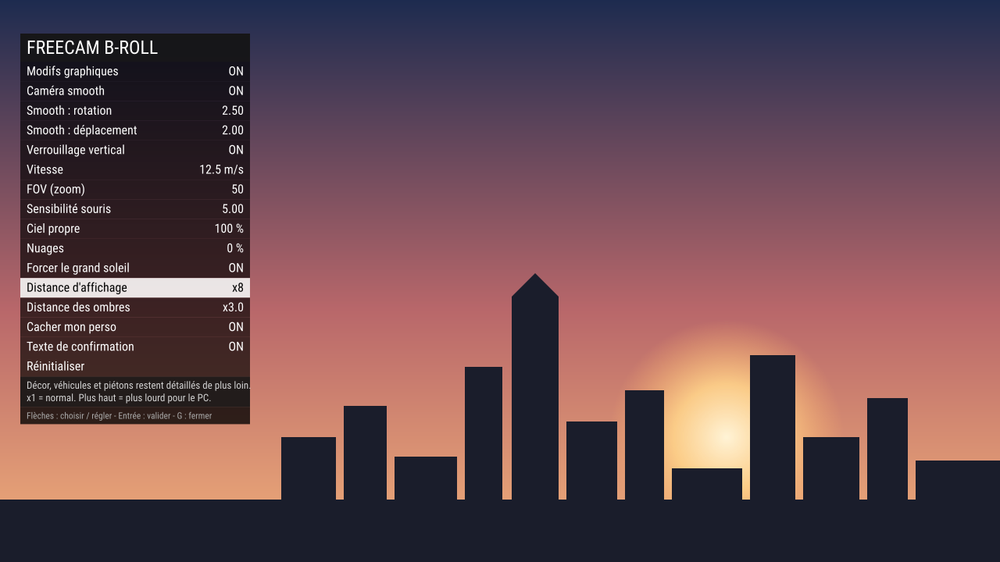

<div align="center">


# Freecam Editor

Une caméra libre **sans aucun affichage** pour tourner des B-rolls propres sur FiveM : pas de HUD, pas de mains, pas d'armes, juste l'image.

[**⬇ Télécharger (.zip)**](https://github.com/StundZow/Freecam-Editor/archive/refs/heads/main.zip) · [Signaler un problème](https://github.com/StundZow/Freecam-Editor/issues)



<sub>Aperçu du menu de réglages (touche G), affiché par-dessus l'image du jeu.</sub>

</div>

## Ce que ça fait

Freecam Editor s'adresse aux créateurs qui filment des plans d'illustration dans GTA via FiveM : survols de la ville, travellings dans une rue, plans fixes au coucher du soleil.

Un appui sur `F11` détache la caméra de ton perso : tout l'affichage disparaît, et tu voles librement dans la direction où tu regardes, à travers les murs. Le mode smooth adoucit chaque mouvement façon caméra cinématique, et un menu en jeu règle tout en direct, sans jamais quitter le plan.

## Pourquoi pas juste un noclip ?

Parce qu'un noclip déplace ton perso : le HUD reste à l'écran, la caméra suit en vue à la troisième personne, et chaque coup de souris se voit dans la vidéo. Ici la caméra est indépendante, l'écran est vierge, les mouvements sont lissés, et le rendu lui-même est retravaillé pour l'image : plus de brume au loin, décor détaillé beaucoup plus loin.

## Fonctionnalités

- 🎥 **Caméra libre** qui va là où tu regardes, haut et bas compris, à travers les murs
- 🫥 **Zéro affichage** — HUD, mini-map, notifications, mains et armes masqués ; ton perso est caché sur ton écran uniquement
- 🧈 **Mode smooth** façon zoom OptiFine, avec réactivité réglable séparément pour la rotation et les déplacements
- 📏 **Verrouillage vertical** — la caméra regarde où tu veux mais reste à la même hauteur, idéal pour les travellings
- ☁️ **Ciel propre** — brume supprimée avec une intensité de 0 à 100 %, opacité des nuages réglable, grand soleil forcé si tu veux
- 🏙️ **Distance d'affichage étendue** jusqu'à x15 pour le décor, les véhicules et les piétons, et jusqu'à x10 pour les ombres
- 🎛️ **Menu en jeu** — tout se règle en direct pendant que tu voles, et tes réglages sont mémorisés d'une session à l'autre
- 🔒 **Permission ACE optionnelle** pour réserver la freecam à certains joueurs sur un serveur public

## Prise en main

1. [Télécharge le .zip](https://github.com/StundZow/Freecam-Editor/archive/refs/heads/main.zip) et décompresse-le dans le dossier `resources` de ton serveur. Renomme le dossier `freecam_editor` (n'importe quel nom sans espace fonctionne).
2. Ajoute dans `server.cfg` :
   ```
   ensure freecam_editor
   ```
3. Redémarre le serveur.
4. En jeu, appuie sur `F11` (ou tape `/freecam`) pour lancer la caméra, puis sur `G` pour ouvrir le menu de réglages.

*(Tu peux aussi cloner le dépôt directement : `git clone https://github.com/StundZow/Freecam-Editor.git freecam_editor`.)*

Ressource autonome : aucun framework requis (ni ESX, ni QBCore).

## Touches

| Touche | Action |
| --- | --- |
| `F11` ou `/freecam` | Activer / désactiver la freecam |
| Souris | Regarder |
| Touches de déplacement | Avancer dans la direction du regard (haut et bas compris) |
| Molette | Régler la vitesse |
| `Shift` | Boost de vitesse tant que la touche est maintenue |
| `E` ou `Espace` | Monter à la verticale |
| `A` ou `Ctrl` | Descendre à la verticale |
| `G` | Ouvrir / fermer le menu de réglages |
| `H` | Verrouillage vertical |

`F11`, `G` et `H` se changent en jeu : Échap > Paramètres > Raccourcis clavier > FiveM. Un raccourci direct pour le mode smooth y est aussi proposé, sans touche par défaut.

## Menu de réglages

Flèches haut / bas pour choisir une ligne, gauche / droite pour régler, Entrée pour valider, `G` ou Retour arrière pour fermer. La caméra reste pilotable pendant que le menu est ouvert : chaque changement se voit immédiatement à l'image.

| Réglage | Effet |
| --- | --- |
| Modifs graphiques | Active ou coupe d'un coup le ciel propre, les nuages, le grand soleil et les distances d'affichage, sans perdre leurs valeurs |
| Caméra smooth | Adoucit la rotation et les déplacements |
| Smooth : rotation / déplacement | Réactivité du mode smooth ; plus petit = plus flottant |
| Verrouillage vertical | La hauteur ne change plus quand tu avances |
| Vitesse | Vitesse de vol, aussi réglable à la molette |
| FOV (zoom) | Angle de vue ; plus petit = plus zoomé |
| Sensibilité souris | Vitesse de rotation de la caméra |
| Ciel propre | Suppression de la brume, de 0 % (normale) à 100 % (image nette même de très loin) |
| Nuages | Opacité des nuages, de 0 % (aucun) à 100 % (normaux) |
| Forcer le grand soleil | Météo dégagée et sans pluie, quelle que soit celle du serveur |
| Distance d'affichage | De x1 à x15 : décor, véhicules et piétons restent détaillés de plus loin |
| Distance des ombres | De x1 à x10 : les ombres portent plus loin, mais deviennent moins nettes en montant |
| Cacher mon perso | Ton perso devient invisible sur ton écran |
| Texte de confirmation | Petit texte en bas de l'écran quand tu changes la vitesse ou le verrouillage |
| Réinitialiser | Remet toutes les valeurs de départ de `config.lua` |

## Comment ça marche

La freecam est une caméra scriptée détachée de ton perso : lui reste immobile là où tu l'as laissé, pendant que le jeu charge la carte autour de la caméra plutôt qu'autour de lui. C'est ce qui permet de partir loin sans trous dans le décor.

**Tout est local.** Le ciel propre, la météo forcée, la distance d'affichage et l'invisibilité de ton perso ne s'appliquent qu'à ton écran : les autres joueurs ne voient aucun changement, et continuent de voir ton perso à sa place.

Le ciel propre repose sur un filtre d'image créé à la volée, qui coupe la brume et repousse la distance de vue à plusieurs dizaines de kilomètres. Le jeu mélange ce filtre avec l'image normale selon l'intensité choisie ; comme la brume réagit très fortement aux premiers pourcents, la courbe est recalculée pour que le curseur reste progressif sur toute sa course.

Le mode smooth utilise un lissage exponentiel calé sur le temps réel de chaque image : il donne la même sensation à 30 ou à 240 FPS.

Tes réglages sont enregistrés sur ton PC (stockage local de FiveM), donc chaque joueur garde les siens. Et si une erreur survient pendant la freecam, elle se coupe proprement et te rend la vue normale, plutôt que de te laisser bloqué dans la caméra.

## Réglages de départ

`config.lua` contient les valeurs de départ — celles que « Réinitialiser » remet — ainsi que les touches par défaut et la vitesse maximale. Une fois en jeu, tout se règle depuis le menu.

Par défaut, tous les joueurs peuvent utiliser la freecam. Pour la réserver, renseigne une permission ACE dans `config.lua` :

```lua
Config.AcePermission = 'freecam.use'
```

puis donne-la dans `server.cfg` :

```
add_ace group.admin freecam.use allow
```

## Limites connues

- Les HUD ajoutés par d'autres ressources du serveur (interfaces ESX / QBCore, jauges de vie et de faim, noms au-dessus des têtes) ne sont pas masqués : ils s'affichent par une autre voie que celle du jeu.
- La circulation n'apparaît qu'autour de ton perso, pas autour de la caméra : loin de lui, les rues peuvent être vides.
- Plus la distance d'affichage est élevée, plus le PC travaille : sur un survol rapide à x15, attends-toi à des baisses de FPS ou à des textures qui chargent en retard.
- Quand une mise à jour ajoute des fichiers à la ressource, un simple redémarrage de la ressource ne suffit pas : fais `refresh` puis `ensure freecam_editor` dans la console du serveur, ou redémarre le serveur.
